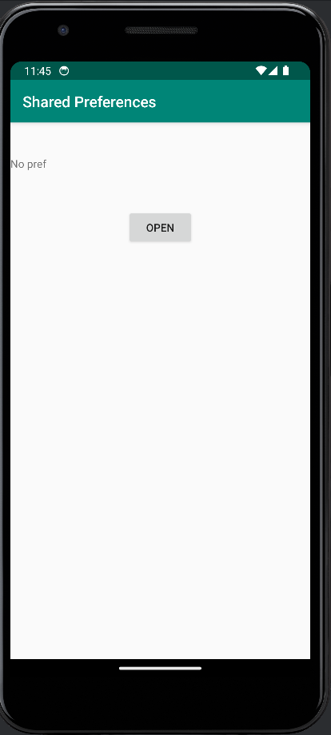
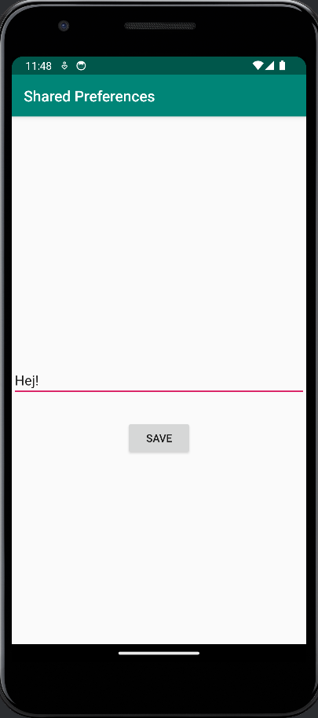
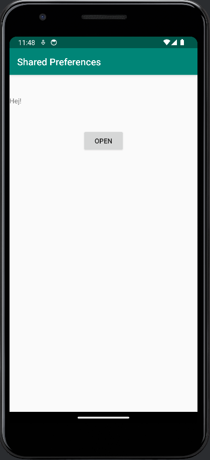

# Rapport
I denna uppgift skulle shared preferences användas. Först skapades en ny activity och en xml fil för denna activity. Efter detta lades kod in i main activity som har en knapp och en textView.
Knappen kommer öppna den andra activity och i den andra activity finns en EditText ruta och en knapp. I EditText kan man skriva in egen text och knappen som finns på andra activity sparar och byter activity tillbaka till Main.
Koden i Main kommer sedan kunna hämta den string som blivit sparad i den andra activity och sedan visa upp i sin TextView.


Koden nedan visar hur main och second activity hanterar text och hur de använder onClick för att byta activity. 
```
Main activity:

TextView prefTextRef=new TextView(this);
prefTextRef=(TextView)findViewById(R.id.prefText);
prefTextRef.setText(myPreferenceRef.getString("MyAppPreferenceString", "No pref"));

Button changeAct=findViewById(R.id.changeAct);
changeAct.setOnClickListener(new View.OnClickListener() {
@Override
public void onClick(View view) {
Intent intent = new Intent(MainActivity.this, SecondActivity.class);
startActivity(intent);
}

Second activity:

 public void savePref(View back){
        // Get the text
        EditText newPrefText=new EditText(this);
        newPrefText=(EditText)findViewById(R.id.settingseditview);

        // Store the new preference
        myPreferenceEditor.putString("MyAppPreferenceString", newPrefText.getText().toString());
        myPreferenceEditor.apply();

        // Clear the EditText
        newPrefText.setText("");

        Intent intent = new Intent(SecondActivity.this, MainActivity.class);
        startActivity(intent);
    }
```


### Screenshots



